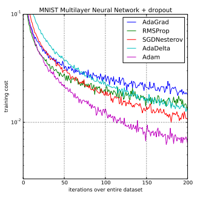

# ML_Project | Image Classifier based on CIFAR-10 Dataset

## How To
* With Pre-Trained Model
  * Copy the content of folder "Pre_Trained_Model" to the parent folder
  * python save_pre_processed_data.py
  * python test_cnn.py
* Without Pre-Trained Model
  * python save_pre_processed_data.py
  * GoTo file: train.py
    * Change the value of "save_model_path" to your desired path
    * python train.py (This step may take a couple of hours depending on your machine) 
  * python test_cnn.py    

## 1. List of files
* data_batch_1
* data_batch_2
* data_batch_3
* data_batch_4
* data_batch_5
* test_batch

Each file packs the data using pickle module in python.

## 2. Understanding the original image dataset
* The original one batch data is (10000 x 3072) matrix expressed in numpy array.
* The number of columns, (10000), indicates the number of sample data.
* The row vector, (3072) represents an color image of 32x32 pixels.
* Since this project is going to use CNN for the classification tasks, the original row vector is not appropriate. In order to feed an image data into a CNN model, the dimension of the input tensor should be either (width x height x num_channel) or (num_channel x width x height).

We are going forward with (width x height x num_channel)

* Each image vector is of size 3072 which is equal to 32x32x3
* In order to get the input tensor shape for the CNN, we need to use the following
  * Reshape - convert [1, 3072] to [3, 32, 32]
  * Transpose - convert [3, 32, 32] to [32, 32, 3]


  
## 3. The original labels
The label data is just a list of 10,000 numbers ranging from 0 to 9, which corresponds to each of the 10 classes in CIFAR-10
* airplane : 0
* automobile : 1
* bird : 2
* cat : 3
* deer : 4
* dog : 5
* frog : 6
* horse : 7
* ship : 8
* truck : 9

## 4. Pre-Process Input Data-Set
### 4.1 Problem
The pixel values ranges from 0 to 255. When such a value is passed into sigmoid function, the output is almost always 1, and when it is passed into ReLU function, the output could be very huge. When back-propagation process is performed to optimize the network, these output values could lead to an vanishing gradient problems. In order to avoid the issue, it is better let all the values be around 0 and 1.

### 4.2 Solution
Min-Max Normalization

```
  Normalized_Value = (value - min_value) / (max_value - min_value)
```

## 5. Activation Function Used
We used ReLU activation function. It takes an input value and outputs a new value ranging from 0 to infinity. When the input value is somewhat large, the output value increases linearly.


## 6. Splitting of data into training-set, validation-set and test-set
The CIFAR-10 dataset comprises of 5 batches of training-sets each having 10000 examples and a test-set of 10000 examples.

* Validation-Set: Last 10% of data from every batches will be combined to form the validation dataset.
* Training-Set: The remaining 90% of data is used for training.
* Test-Set: Provided with the original data.

## 7. Machine Learning Classifier
For image classification we are using convolutional neural networks. We will be using Tensoflow library by Google for designing the neural network.
* The image data should be fed in the model so that the model could learn and output its prediction.
* The label data should be provided at the end of the model to be compared with predicted output.
* **tf.placeholder** in TensorFlow creates an Input. Each Input requires to specify what data-type is expected and the its shape of dimension. None in the shape means the length is undefined, and it can be anything.

### 7.1 Building the convolutional Layers
When building a convolutional layer, there are three things to consider. That is the stride, padding, and filter.

#### 7.1.1 Filter
A tensor of 3 dimensions that has the weights and convolutes over the input tensors.

#### 7.1.2 Strides
The stride determines how much the window of filter should be moved for every convolving steps, and it is a 1-D tensor of length 4.
Example
Lets take a tensor of a grayscale image
00 01 02 03 ....
10 11 12 13 ....
20 21 22 23 ....

A stride of [1,1,1,1] with a filter of [2x2] means that the filter will cover
````
[ 00 01
  10 11
]
in its first iteration and then 
[ 01 02
  11 12
]
in the second and after the end of first row
[ 10 11
  20 21 
]
and so on
````
stride[0]: No of examples to skip

stride[3]: No of depth to skip

These should be 1 because we don't want to skip any of our data, otherwise we shouldn't have included that in the first place.

#### 7.1.3 Padding
Consider an input tensor - [1,2,3,4,5]

Filter: [4,1,1]

Stride: [1,3,1,1]

Tensorflow provides two types of paddings
* VALID
````
    Output: [1,2,3,4]
    [5] will be dropped
````
* SAME
````
    Output: [1,2,3,4 |  4,5,0,0]
    [0,0] will be padded at the end
````

We will use SAME padding as it will ensure same size of the image after convulation.

#### 7.1.4 Max-Pooling
Max-Pooling can be considered as a special type of convolution, except it doesn't have weights. The purpose is to shrink the image by letting the strongest value survived. ksize=[1,2,2,1] and strides=[1,2,2,1] will shrink the image into half size.

### 7.2 Aim
Minimize the cost by applying a algorithm of your choice

### 7.3 Cost Function & Optimizer
* Logits: A vector of raw (non-normalized) predictions that a classification model generates, which is ordinarily then passed to a normalization function. If the model is solving a multi-class classification problem, logits typically become an input to the softmax function. The softmax function then generates a vector of (normalized) probabilities with one value for each possible class.

* Cost: This is the reduced mean between the softmax (normalized) logits calculated by the network that we designed and the actual output class. The output classes are also one-hot encoded, where the actual class has a probalility of 1 and other have a probability of 0.

* Optimizer Algorithm (Adam Optimizer): Unlike Stochastic gradient descent where the learning rate does not change during training, in case of AdamOptimizer, the learning rate is maintained for each network weight (parameter) and separately adapted as learning unfolds.



* Accuracy
  * We compare the index of max value of logits for each example with the actual output. If they are same, then the image is correctly classified, else the prediction was wrong.
  * We take a mean of all these correct predictions to find the accuracy of the batch.

## 8. Training
The process of training requires you to define the following hyperparameters
* epochs: The number of times you need to train the classifier using the same example. We started with 5 and ultimately settled at 10, because beyond that the accuracy was not improving.
* batch_size = The number of examples that you want to process parallelly. It depends on your system memory. We choose 128 keeping in mind the hardware constraints of our system.
* keep_probability = in what probability how many units of each layer should be kept. We choose 0.7. This makes the dropout to be 30%.
* learning_rate = The smallest change that the optimizer will make in order to minimize the cost. We choose 0.001, as this value is the default recommended value by tensorflow.

````
We used the validation-set to calculate this accuracy.

Epoch  1, CIFAR-10 Batch 1:  Loss:     2.1369 Validation Accuracy: 0.237200
Epoch  1, CIFAR-10 Batch 2:  Loss:     1.6714 Validation Accuracy: 0.316400
Epoch  1, CIFAR-10 Batch 3:  Loss:     1.3447 Validation Accuracy: 0.401000
Epoch  1, CIFAR-10 Batch 4:  Loss:     1.4517 Validation Accuracy: 0.461800
Epoch  1, CIFAR-10 Batch 5:  Loss:     1.4294 Validation Accuracy: 0.493200
Epoch  2, CIFAR-10 Batch 1:  Loss:     1.1890 Validation Accuracy: 0.548200
Epoch  2, CIFAR-10 Batch 2:  Loss:     1.0403 Validation Accuracy: 0.533000
Epoch  2, CIFAR-10 Batch 3:  Loss:     0.8671 Validation Accuracy: 0.586000
Epoch  2, CIFAR-10 Batch 4:  Loss:     0.8815 Validation Accuracy: 0.602800
Epoch  2, CIFAR-10 Batch 5:  Loss:     0.8441 Validation Accuracy: 0.616000
....
....
....
Epoch 10, CIFAR-10 Batch 1:  Loss:     0.0111 Validation Accuracy: 0.729800
Epoch 10, CIFAR-10 Batch 2:  Loss:     0.0150 Validation Accuracy: 0.729200
Epoch 10, CIFAR-10 Batch 3:  Loss:     0.0097 Validation Accuracy: 0.736600
Epoch 10, CIFAR-10 Batch 4:  Loss:     0.0282 Validation Accuracy: 0.737000
Epoch 10, CIFAR-10 Batch 5:  Loss:     0.0092 Validation Accuracy: 0.729600
````

## 9. Testing
* As mentioned earlier, we are provided with a dedicated test-set of 10000 examples. 
* We will use that set to test the accuracy of this model.
* This step is exactly similar to the validation accuracy in the above image. The input will change from validation-set to test-set.
* Steps
  * Calculate Logits using the trained neural network
  ````
   [
      -3.5272131,
      -4.8528223,
      -1.36957669,
      7.41049385, // Max Value (Index - 3)
      -2.18015099,
      3.23953629,
      -1.27799594,
      -2.93476057,
      -1.17643523,
      -2.84120584
    ],
    [
      1.88694978,
      0.929766893,
      -1.07205653,
      -2.12049198,
      -4.22954178,
      -5.52185345,
      -3.78540659,
      -7.54574299,
      11.0548038, // Max Value (Index - 8)
      0.0308044963
    ]
  ````
  * Normalize the logits
  * Find the index of logit that has the max value
  * Compare it with the actual output.
  ````
   [
      0.0,
      0.0,
      0.0,
      1.0, // Max Value (Index - 3)
      0.0,
      0.0,
      0.0,
      0.0,
      0.0,
      0.0
    ],
    [
      0.0,
      0.0,
      0.0,
      0.0,
      0.0,
      0.0,
      0.0,
      0.0,
      1.0, // Max Value (Index - 8)
      0.0
    ]
  ````
  * Determine the final accuracy.
  ````
  Testing Accuracy: 0.7282046178343949
  ````
  
